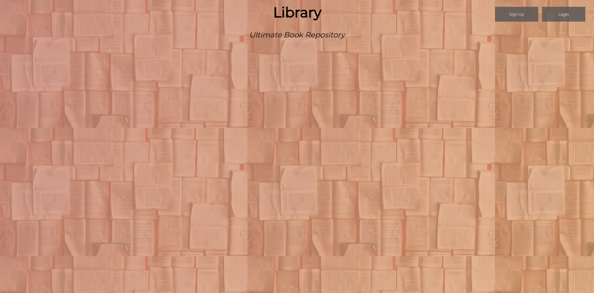

<h1>Library Management Web App</h1>

I call this app <b>Bookkeeper</b>

<h2>About</h2>

The app uses JavaScript to provide functionality to the page and HTML and CSS is used. Currently, the wep app is only supported on Desktop, running it on mobile or tablet browser may lead to problems in styling. In this web app we can login into our account and keep a record of books we have read, have been reading or will read in future.

<h2>Goals for future:</h2>

    My goal is to make a library management system, if you don't see that, it means project is still under development and what you are using is a beta version of the application. As of 17th June 12:00 AM, I have added features from my other project library plus made it individual user driven project, i.e. you can signup/login into your account to view your books. I have added an update book feature ,update password feature and an update profile feature. I am planning on adding an update user information feature, which can be accessed from a side panel along with other tools like adding book, logging out etc. which are now scattered across your page.Also, my aim for the future is to add fields which indicate the book status right now i.e whether you own it or you have borrowed it from someone.

[Do visit my page](https://lonewolf045.github.io/library-management/index.html)  
If you want to know how a collective library page is, then [click here](https://personal-library.firebaseapp.com/) [or here](https://lonewolf045.github.io/library/index.html)

<b><i>*Warning</i></b> 
Note- If you want to signup into the account, please choose a password which is not used by you regularly, beacuse every data you enter is visible to me. Rememeber, "<b><i>Big Brother is watching you</i></b>".
:sunglasses:

If you want to contact me, then you can try.

<h3>Here, our few screenshots of how web app looks like</h3>

1.Home Page 

  
2.Login Menu 

  
3.SignUp Menu 

  
4.Logging In 

  
5.User Home Page with welcome message  

  
6.Collapsible Side Menu 

  
7.Add New Book 

  
8.New Book Form filled 

  
9.Book Tile 

  
10.Update Profile 

  
11.Update Password 
